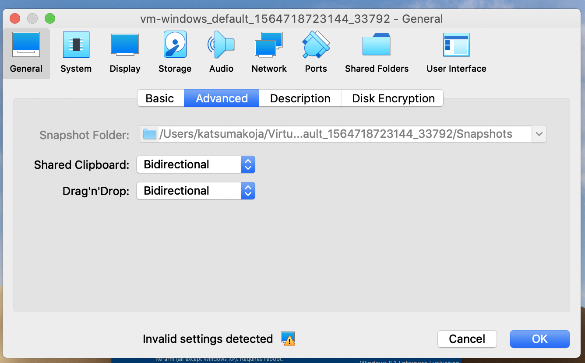

Vagrantでwindows8(ie11)環境を作る

## 事前準備

VirtualBoxとvagrantをインストール

```sell
brew cask install virtualbox
brew cask install vagrant
```

## box追加

```shell
wget https://az792536.vo.msecnd.net/vms/VMBuild_20150916/Vagrant/IE11/IE11.Win81.Vagrant.zip
unzip IE11.Win81.Vagrant.zip 
mv IE11\ -\ Win81.box win8ie11.box 
vagrant box add win8ie11.box --name win8ie11
```


## 起動

Vagrantfileがあるとこで実行

```shell
vagrant up
```


## スナップショット/リストア

使用期限が90日なので、スナップショットを取っておく.

あらかじめ`vagrant halt` でシャットダウンしておくこと。

```shell
vagrant halt 
vagrant snapshot save initialpoint
```

リストア

```shell
vagrant restore initialpoint
```

## tips

HOST <=> GUEST 間でコピペを有効にする。
`Machine => Settings... => General => Advanced` で以下のように設定する。




